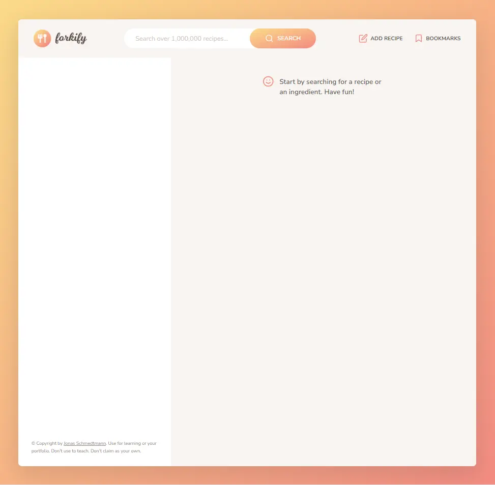

### 👋 **I am Erhan ERTEM**

&emsp;

## Udemy The Complete JavaScript Course 2022 From Zero to Expert! by Jonas Schmedtmann

### **Objective:** Create a recipe app that holds user entered recipes along with the app's default online hosted recipes

&emsp;

Main takeaways:

- Establish MVC Architecture
- Working with Async functions
- Dealing with online-API for exchanging JSON data (Forkify API)
- Subscriber-Publisher type eventhandling
- FormData Web API
- History Web API
- JSDoc documentation

TODO List:

- Calc calories of each ingredient from spoonacular API
- Weekly meal planner feature that would assign recipes for the next 7 days
- A button printing out a shopping list to the user for the selected recipe in recipeView
- Implement ingredient input in a more robust multiple drop down menu style
- Ingredient validation before submitting the form
- Sort search retults by time of register, calories, etc.
- Display number of current page between the pagination buttons

&emsp;

###### ⚠️This project functionality is dependant on an online API

#### [Forkify-App](https://forkify-app-erhan-ertem.netlify.app)

---

  
